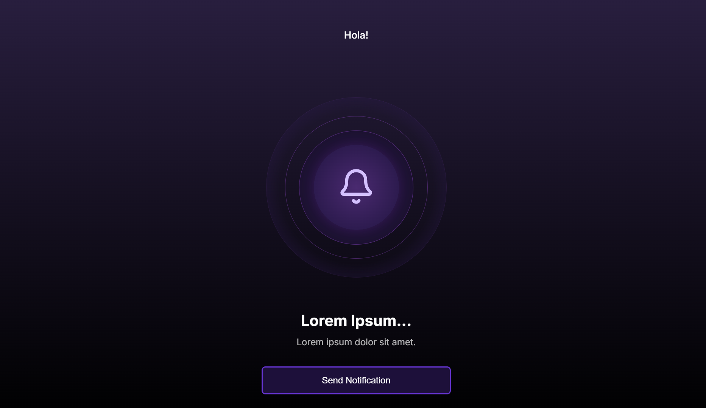

# Bell-CSS

A simple web notification demonstration app with beautiful animations.



## Live Demo

Check out the live demo at: [bell-css.vercel.app](https://bell-css.vercel.app)

## Overview

Bell-CSS is a frontend demonstration project showcasing web notification capabilities with stylish CSS animations. This project was created as an assignment to test frontend development skills, focusing on:

- Web Notifications API integration
- Smooth UI animations
- Clean, modern design
- Service Worker implementation
- Responsive layout

## Features

- Request and display browser notifications
- Visual feedback with animation when notifications are sent
- Graceful permission handling
- Background grid animation
- PWA-ready with service worker registration

## Technologies Used

- React
- Next.js
- CSS Animations
- Service Workers
- Web Notifications API

## Installation

Clone the repository:

```bash
git clone https://github.com/SimpleCyber/Bell-CSS.git
cd Bell-CSS
```

Install dependencies:

```bash
npm install
# or
yarn install
```

Run the development server:

```bash
npm run dev
# or
yarn dev
```

Open [http://localhost:3000](http://localhost:3000) in your browser to see the result.

## Usage

1. Click the bell icon to request notification permissions (if not already granted)
2. Once permissions are granted, clicking the bell will send a test notification
3. The UI will provide visual feedback when a notification is sent

## Project Structure

- `/components` - React components including the notification bell and background grid
- `/lib` - Utility functions like service worker registration
- `/public` - Static assets including icons for notifications
- `/pages` - Next.js page components

## Browser Compatibility

This application works best in modern browsers that support the Web Notifications API:
- Chrome
- Firefox
- Edge
- Safari (MacOS)

Note: Mobile browsers have varying levels of support for the Web Notifications API.

## Repository

The source code is available on GitHub: [https://github.com/SimpleCyber/Bell-CSS](https://github.com/SimpleCyber/Bell-CSS)

## License

MIT
